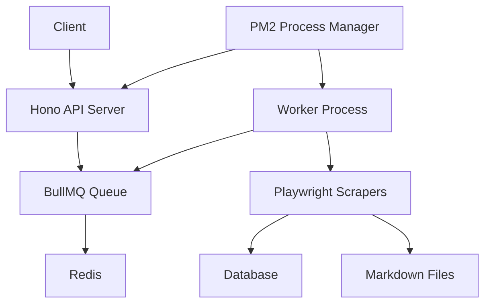

# 🎭 Production-Ready Web Scraping System

A modern, scalable web scraping system built with **Playwright**, **BullMQ**, **Hono**, and **Bun**. This system demonstrates production-ready architecture for automated web scraping with queue management, RESTful API, and process monitoring.

## 🏗️ Architecture Overview



## 🚀 What We Built

### **Core Components:**

1. **🎭 Playwright Scrapers**
   - Automated browser control for dynamic content
   - **Quotes Scraper:** Multi-page scraping with beautiful Markdown output
   - **Reddit Scraper:** Smart subreddit parsing, post type detection, anti-bot evasion
   - Support for TikTok (extensible architecture)

2. **🐂 BullMQ Queue System**
   - Reliable job queue with Redis backend
   - Automatic retries for failed jobs
   - Job progress tracking and monitoring

3. **🔥 Hono REST API**
   - Lightning-fast API server built on Bun
   - Endpoints for triggering scrapes, monitoring jobs, retrieving data
   - Health checks and system statistics

4. **💾 SQLite Database**
   - Persistent storage for scraped content
   - Job tracking and status management
   - Full-text search capabilities

5. **🚀 PM2 Process Management**
   - Automatic process restarts on crashes
   - Log management and monitoring
   - Production-ready deployment

## 📁 Project Structure

```
Scraper Script/
├── src/
│   ├── scrapers/         # 🎭 Playwright scrapers
│   │   ├── quotes-scraper.ts
│   │   └── reddit-scraper.ts
│   ├── workers/          # 🐂 BullMQ job processors  
│   │   └── scraper-worker.ts
│   ├── api/              # 🔥 Hono REST API
│   │   └── server.ts
│   ├── database/         # 💾 SQLite database setup
│   │   └── database.ts
│   └── config/           # ⚙️ Configuration files
│       ├── redis.ts
│       └── bullmq.ts
├── data/                 # 📊 Scraped results & database
├── logs/                 # 📝 Application logs  
├── server.ts             # 🔥 API server entry point
├── worker.ts             # 🐂 Worker entry point
├── ecosystem.config.cjs  # 🚀 PM2 configuration
└── package.json          # 📦 Dependencies & scripts
```

## 🔧 Quick Start

### **Prerequisites**
- Bun installed (`curl -fsSL https://bun.sh/install | bash`)
- Redis running (`brew install redis && brew services start redis`)
- PM2 for production (`bun add -g pm2`)

### **Installation & Setup**
```bash
# Clone and setup
cd "Scraper Script"
bun install

# Create directories
mkdir -p data logs

# Test the scrapers
bun run src/scrapers/quotes-scraper.ts    # Test quotes scraper
bun run src/scrapers/reddit-scraper.ts    # Test Reddit scraper
```

### **Development Mode**
```bash
# Terminal 1: Start API Server
bun run dev:server

# Terminal 2: Start Worker
bun run dev:worker

# Test the API
curl http://localhost:3000/health
```

### **Production Deployment**
```bash
# Start with PM2
bun run pm2:start

# Monitor processes
bun run pm2:status
bun run pm2:logs

# Stop all processes
bun run pm2:stop
```

## 🎯 API Endpoints

### **Core Endpoints**
| Method | Endpoint | Description |
|--------|----------|-------------|
| `GET` | `/` | Welcome & API documentation |
| `GET` | `/health` | System health check |
| `POST` | `/scrape` | Trigger scraping job |
| `GET` | `/jobs/:id` | Get job status |
| `GET` | `/jobs` | List all jobs |
| `GET` | `/results` | Get scraped content |
| `GET` | `/stats` | System statistics |

### **Quick Test Endpoints**
| Method | Endpoint | Description |
|--------|----------|-------------|
| `POST` | `/quick/quotes` | Start quotes scraping |
| `POST` | `/quick/reddit` | Start Reddit scraping (r/programming) |

### **Example API Usage**

**Trigger scraping jobs:**
```bash
# Quotes scraping
curl -X POST http://localhost:3000/scrape \
  -H "Content-Type: application/json" \
  -d '{
    "type": "scrape-quotes",
    "url": "http://quotes.toscrape.com",
    "pages": 3
  }'

# Reddit scraping  
curl -X POST http://localhost:3000/scrape \
  -H "Content-Type: application/json" \
  -d '{
    "type": "scrape-reddit",
    "url": "https://old.reddit.com/r/programming",
    "pages": 5
  }'
```

**Quick testing:**
```bash
curl -X POST http://localhost:3000/quick/quotes     # Quick quotes test
curl -X POST http://localhost:3000/quick/reddit     # Quick Reddit test
```

**Check job status:**
```bash
curl http://localhost:3000/jobs/YOUR_JOB_ID
```

**Get scraped results:**
```bash
curl "http://localhost:3000/results?source=quotes&limit=10"   # Quotes only
curl "http://localhost:3000/results?source=reddit&limit=10"   # Reddit posts only  
curl "http://localhost:3000/results?limit=20"                 # All scraped content
```

## 🎭 Available Scrapers

### **1. Quotes Scraper** ✅ (Complete)
- **Target:** `http://quotes.toscrape.com`
- **Data:** Quote text, authors, tags
- **Format:** Beautiful Markdown output
- **Features:** Multi-page scraping, rate limiting

### **2. Reddit Scraper** ✅ (Complete)
- **Target:** `https://old.reddit.com` (with fallback strategies)
- **Data:** Post titles, authors, upvotes, comments, post types (text/link/image/video)
- **Features:** 
  - Smart subreddit parsing with URL extraction
  - Anti-bot detection evasion (stealth browser settings)
  - Intelligent post type detection (text, link, image, video)
  - Fallback extraction for enhanced reliability
  - Full worker integration with job status tracking

### **3. TikTok Scraper** 🚧 (Bonus Feature)
- **Target:** `https://tiktok.com`
- **Data:** Video metadata, descriptions, hashtags
- **Features:** Anti-bot evasion, rate limiting

## 📊 Data Output Examples

### **Quotes - Markdown Format**
```markdown
# 📚 Scraped Quotes Collection

*Scraped 20 quotes on 2025-08-24*

---

## Quote 1

> "The world as we have created it is a process of our thinking..."

**Author:** Albert Einstein
**Tags:** `change`, `deep-thoughts`, `thinking`, `world`
```

### **Reddit Posts - Structured Data**
```
📊 Successfully extracted 5 real Reddit posts!
📈 Post types found: { link: 3, image: 1, video: 1 }

Sample Post:
Title: "Don't pick weird subnets for embedded networks, use VRFs"
Author: u/Comfortable-Site8626
Upvotes: 175 | Comments: 25
Type: link
Subreddit: r/programming
```

### **JSON API Response**
```json
{
  "success": true,
  "results": [
    {
      "id": 15,
      "source": "reddit",
      "url": "https://old.reddit.com/r/programming/comments/xyz123/",
      "title": "Don't pick weird subnets for embedded networks",
      "content": "**Author:** u/Comfortable-Site8626\n**Upvotes:** 175\n**Comments:** 25\n**Type:** link",
      "scrapedAt": "2025-08-25T12:09:35.000Z",
      "metadata": {
        "subreddit": "programming",
        "postType": "link", 
        "upvotes": 175,
        "comments": 25,
        "author": "Comfortable-Site8626"
      }
    },
    {
      "id": 1,
      "source": "quotes", 
      "url": "http://quotes.toscrape.com",
      "title": null,
      "content": "> \"The world as we have created it...\"",
      "scrapedAt": "2025-08-24T12:00:00.000Z",
      "metadata": {
        "author": "Albert Einstein",
        "tags": ["change", "deep-thoughts"]
      }
    }
  ]
}
```

## ⚙️ Configuration

### **Environment Variables**
```bash
# Server Configuration
PORT=3000
NODE_ENV=production

# Redis Configuration  
REDIS_HOST=127.0.0.1
REDIS_PORT=6379

# Worker Configuration
WORKER_CONCURRENCY=2
```

### **BullMQ Settings**
- **Default Retries:** 3 attempts
- **Retry Delay:** Exponential backoff (2s, 4s, 8s)
- **Job Retention:** 50 completed, 20 failed jobs
- **Concurrency:** 2 simultaneous jobs

## 🔍 Monitoring & Logs

### **PM2 Monitoring**
```bash
# Real-time monitoring dashboard
pm2 monit

# Process status
pm2 status

# View logs
pm2 logs

# Restart all processes
pm2 restart all
```

### **Log Files**
- `logs/api-out.log` - API server output
- `logs/api-error.log` - API server errors
- `logs/worker-out.log` - Worker output
- `logs/worker-error.log` - Worker errors

### **Health Monitoring**
```bash
# Check system health
curl http://localhost:3000/health

# Get system statistics
curl http://localhost:3000/stats
```

## 🧹 Maintenance Commands

```bash
# Clean up data and logs
bun run clean

# Restart PM2 processes
bun run pm2:restart

# Update dependencies
bun update

# View queue statistics
curl http://localhost:3000/stats
```

## 🎓 Key Technical Achievements

This project demonstrates mastery of several advanced web development concepts:

### **🕷️ Web Scraping Mastery**
- **DOM manipulation** using CSS selectors and JavaScript evaluation
- **Anti-detection techniques** for bypassing bot protection systems
- **Intelligent content parsing** with fallback strategies and error handling
- **Dynamic content handling** using headless browser automation

### **🏗️ Production Architecture**
- **Microservices design** with separate API server and worker processes
- **Message queue integration** using Redis and BullMQ for reliable job processing
- **Database design** with normalized schema for content and job tracking
- **RESTful API design** with comprehensive endpoints and status tracking

### **⚡ Performance & Reliability**
- **Concurrent job processing** with configurable worker concurrency
- **Automatic retry mechanisms** with exponential backoff for failed jobs
- **Process monitoring** and automatic restart capabilities with PM2
- **Comprehensive logging** and health monitoring systems

### **🔧 Modern Development Practices**
- **TypeScript** for type safety and enhanced developer experience
- **Modular architecture** with clear separation of concerns
- **Environment-based configuration** for development and production deployments
- **Error handling** with graceful degradation and comprehensive logging

---

*Built with ❤️ using Bun, Playwright, Hono, BullMQ, and modern JavaScript*

**🚀 Ready for deployment on platforms like Railway, Vercel, or any Node.js hosting service!**